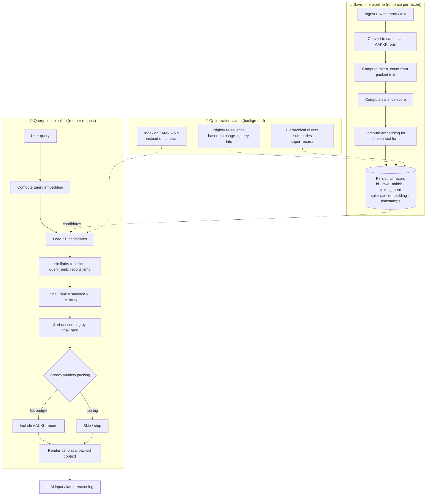

# 🥥 Coconut — Full Latent Reasoning

Coconut is the retrieval-and-packing layer that lets Gaia reason over its **entire**
knowledge base inside a fixed token window without losing fidelity. It does the
expensive work (AAKKK compression, token counting, salience, embeddings) **once at
save time**, then at query time it ranks the whole KB by `salience × similarity` and
greedily packs the most useful records into the context window.

This document is the step-by-step implementation plan: a diagram of the flow, a plain
text walkthrough, and finally the pseudocode.

---

## Flow Diagram



---

## The Steps, Explained

### 1. Freeze the record shape first
Every KB item must store a stable, predictable set of fields before anything else is
built. Pin this down so save-time and query-time always agree on what a record looks
like. Minimum fields:

- `id` (optional `entity`)
- `raw` text — the high-fidelity original
- `aakkk` — the dense compressed form used for packing
- `token_count` — measured from the exact text you intend to pack later
- `salience` — a property of the **memory**
- `embedding` — the retrievable vector
- `created_at` / `updated_at`

### 2. Build the save pipeline (one deterministic pass)
On every save, in a single pass: ingest raw → convert to AAKKK → compute `token_count`
→ compute `salience` → compute `embedding` → persist the full record. Doing all of this
at save time is what makes query time cheap.

### 3. Be strict about what gets embedded
Pick **one** representation and keep it consistent — embed the raw text *or* the AAKKK
text, never a silent mix. Coconut behaves predictably only when save-time and
query-time assumptions stay identical.

### 4. Keep salience separate from similarity
- **Salience** is a property of the memory itself (recency, frequency, user weighting).
- **Similarity** is a property of the query–memory pair (cosine distance).

Keeping them separate makes the ranking easy to reason about and debug.

### 5. AAKKK compression format
Transform content into a dense **Atomic Attribute / Key-Key-Key** line, e.g.:

```
A:entity=Jonty|A:action=keen_on|A:topic=Coconut|K:salience=0.95|K:tokens=42|K:ts=20260628T0458
```

Strip fluff, use abbreviations and clear delimiters so it's machine-parseable. This
typically cuts tokens ~50–70% versus raw text. Store **both**: raw for fidelity, AAKKK
for fast retrieval and packing.

### 6. Build the query pipeline
At query time: take the user query → compute its embedding → load KB candidates →
compute similarity per item → compute `final_rank = salience × similarity` → sort
descending.

### 7. Greedy window packing
Walk the sorted list top to bottom. For each item, if its `token_count` fits the
remaining budget, include it; otherwise skip it (or stop for the simplest first
version). Greedy packing is the correct MVP — easy to ship, easy to inspect.

### 8. Output one canonical packed format
Render every selected item the **same way every time**. Stable rendering gives stable
behaviour and far cleaner debugging.

### 9. Add logging immediately
For every query, log: query text, query embedding generated, top ranked item ids, each
item's salience, each item's similarity, the final score, packed/skipped status, and
total packed tokens. When Coconut feels wrong, the truth shows up here first.

### 10. Test save-time invariants
Prove that save **always** produces AAKKK, `token_count`, salience, and embedding — and
that `token_count` is stable for the same stored text.

### 11. Test query-time invariants
Prove that a query always gets an embedding, ranking is deterministic for fixed inputs,
items are ordered by `salience × similarity`, and packed output **never** exceeds the
token window.

### 12. Ship the dumb version before the clever version
First make it work with a full KB scan, simple `rank = salience × similarity`, and
simple greedy packing. Only then optimize retrieval, indexing (ANN/k-NN), nightly
re-salience, or hierarchical cluster summaries.

**Recommended implementation order for one sitting:**
1. Define record schema.
2. `save()`: raw → AAKKK → token_count → salience → embedding → store.
3. `rank()`: query → query_embedding → score all memories.
4. `pack()`: greedy token-window fill.
5. Add logs.
6. Run with a tiny hand-made KB and inspect ranked results manually.

---

## Pseudocode

```text
// Step 1: Define salience scorer (property of the memory, computed at save time)
//   Hybrid: recency decay * frequency * user weighting.
function computeSalience(entry):
    recency      = exp(-(now - entry.timestamp) / DECAY_DAYS)   // e.g. DECAY_DAYS = 30
    frequency    = entry.access_count / max(total_accesses, 1)
    user_weight  = entry.user_tag_weight                        // user overrides allowed
    return recency * frequency * user_weight

// Step 2: Format an entry into the canonical dense AAKKK line.
//   A: atomic attributes, K: keys/metadata. Strip fluff, fixed delimiters.
function toAAKKK(entry):
    return "A:entity=" + entry.entity +
           "|A:action=" + entry.action +
           "|A:topic="  + entry.topic +
           "|K:salience=" + entry.salience +
           "|K:tokens="   + entry.token_count +
           "|K:ts="       + entry.timestamp

// Step 3: Save pipeline — one deterministic pass per record.
function save(raw):
    entry = {}
    entry.raw         = raw
    entry.aakkk       = toAAKKK(parse(raw))           // canonical compressed form
    entry.token_count = countTokens(entry.aakkk)      // measured on the text we pack
    entry.salience    = computeSalience(entry)
    entry.embedding   = embed(EMBED_TARGET(entry))    // EMBED_TARGET = raw OR aakkk, consistently
    entry.created_at  = now
    entry.updated_at  = now
    persist(entry)                                    // DataLake / KB
    log("save", entry.id, entry.token_count, entry.salience)
    return entry

// Step 4: Rank — score the whole KB for a query (salience stays separate from similarity).
function rank(query, kb):
    query_embedding = embed(query)
    scored = []
    for entry in kb:
        similarity = cosine_similarity(query_embedding, entry.embedding)
        final_rank = entry.salience * similarity      // memory property × query-pair property
        scored.append({ entry: entry, similarity: similarity, final_rank: final_rank })
        log("rank", entry.id, entry.salience, similarity, final_rank)
    sort scored by final_rank DESC                     // deterministic for fixed inputs
    return scored

// Step 5: Pack — greedy token-window fill, canonical output.
function pack(scored, max_tokens):
    packed        = []
    used_tokens   = 0
    total_salience = 0
    for item in scored:                                // walk top -> bottom
        if used_tokens + item.entry.token_count <= max_tokens:
            packed.append(item.entry.aakkk)            // render the SAME way every time
            used_tokens    += item.entry.token_count
            total_salience += item.entry.salience
            log("pack", item.entry.id, "INCLUDED", used_tokens)
        else:
            log("pack", item.entry.id, "SKIPPED", used_tokens)
            // skip and continue, OR `break` for the simplest first version
    return {
        packed:        packed,
        used_tokens:   used_tokens,
        total_salience: total_salience
    }

// Step 6: End-to-end Coconut query.
function coconut(query, kb, max_tokens):
    scored = rank(query, kb)
    result = pack(scored, max_tokens)
    return result.packed                               // canonical context block -> LLM
```

---

## Next Steps

Ship the dumb version first (full scan + `salience × similarity` + greedy pack + logs),
verify it against a tiny hand-made KB, then layer in optimization: nightly re-salience,
hierarchical cluster super-records, and ANN/k-NN indexing to replace the full scan.
