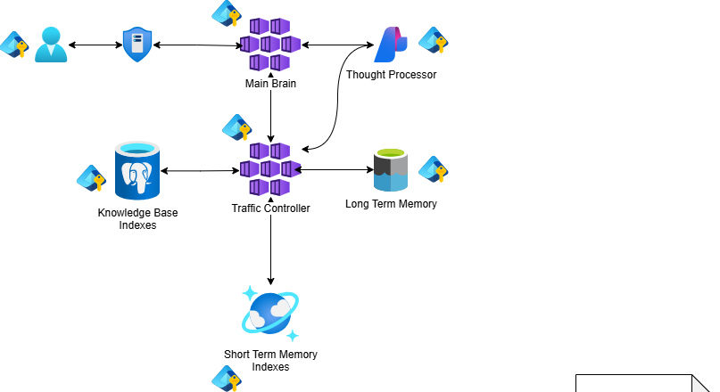
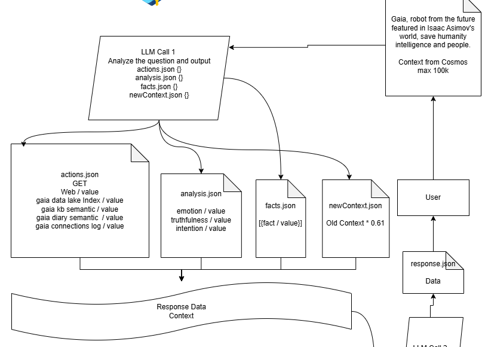
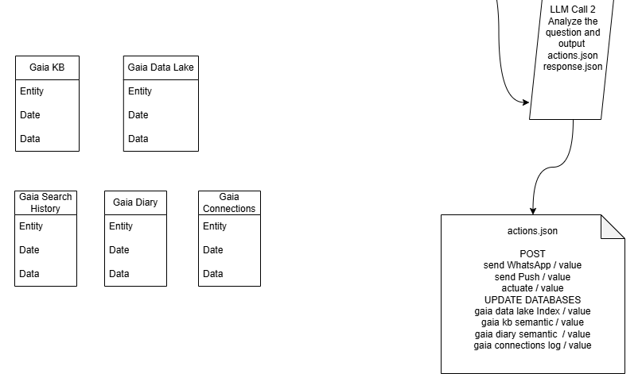

# Gaia Robot 🤖

Gaia is a small robot brain that lives in the cloud. It chats with you,
remembers what matters, searches the web, and keeps a friendly memory of the
people it talks to — inspired by the helpful robots of Isaac Asimov's stories.

## 🚀 Get started

**New here? Start with the [Quick Start guide](QUICKSTART.md).** It walks you
through putting Gaia in the cloud and saying hello, step by step — simple enough
to follow on your first try.

[](https://portal.azure.com/#create/Microsoft.Template/uri/https%3A%2F%2Fraw.githubusercontent.com%2Fthreadkeeper%2Fgaia-robot%2Fmain%2Finfra%2Fazuredeploy.json)

> The **Deploy to Azure** button sets up everything Gaia needs in one click.
> The default **Free / Lite** tier has **no fixed idle cost**. For the cost
> breakdown and all the deployment options, see [infra/README.md](infra/README.md).

## How Gaia thinks

This is the physical architecture — the parts that make up Gaia's brain and how
they connect.


It helps to read the picture in three parts.

### 1. The brain and its memories



The top of the diagram shows Gaia's "organs" and how they're wired together:

- **Main Brain** — the model that talks to you and makes decisions.
- **Thought Processor** — extra reasoning power the brain can lean on.
- **Traffic Controller** — routes each request to the right memory store.
- **Knowledge Base Indexes** — searchable facts Gaia knows.
- **Long Term Memory** — durable storage that survives between chats.
- **Short Term Memory Indexes** — fast, recent context for the current chat.

Together these map onto real Azure services (an AI model, a database, and
search indexes).

### 2. The "pull" pass — gathering what's needed



Every time you say something, Gaia thinks in **two passes**. The first pass
(**LLM Call 1**) is about *gathering information*. It reads your message plus
what it already knows, then decides what to look up — searching the web and its
own memories — **without changing anything**. The results are collected into a
scratchpad called the **Response Data Context**. It also jots down a quick
read of your emotion, any new facts, and a compressed note to carry forward.

### 3. The "push" pass — answering and remembering



The second pass (**LLM Call 2**) is about *acting*. It reads the scratchpad
from the first pass and **writes the reply to you**. It can also take actions
that change things — sending a message, and saving what it learned back into
its memory stores (knowledge base, diary, the friendship ledger, and more).

In short: **Pass 1 reads, Pass 2 writes.** That clean split keeps Gaia safe and
predictable — it never changes anything until it has finished thinking.

## What's in this repository

| Folder       | What's inside                                              |
|--------------|-----------------------------------------------------------|
| `rust/`      | Gaia's program — all the Rust source code.                |
| `infra/`     | Cloud setup and deployment files.                         |
| `web/`       | The web app you chat with.                                |
| `tests/`     | End-to-end tests for the whole program.                   |
| `app/`       | Application assets and runtime resources.                 |
| `research/`  | Notes, experiments, and exploratory work.                 |

## For developers

Gaia's program is written in **Rust** and modeled like a console app:
[`rust/src/main.rs`](rust/src/main.rs) is a single, well-commented orchestrator
you can read top-to-bottom, and each type lives in its own module beside it.

Install Rust with [rustup](https://rustup.rs/) (the toolchain is pinned in
[`rust/rust-toolchain.toml`](rust/rust-toolchain.toml)). All commands run from
the `rust/` folder:

```sh
cd rust
cargo run            # build and start the app
cargo build --release
```

Before pushing, run the same checks CI enforces
([.github/workflows/ci.yml](.github/workflows/ci.yml)):

```sh
cargo fmt --all -- --check                                 # formatting
cargo clippy --all-targets --all-features -- -D warnings   # lint (warnings = errors)
cargo test --all-features                                  # tests
cargo llvm-cov --all-features --fail-under-lines 80        # coverage gate
cargo audit                                                # known vulnerabilities
cargo deny check                                           # licenses, bans, sources
```

The extra tools install once with
`cargo install cargo-llvm-cov cargo-audit cargo-deny`. For fast local feedback,
enable the pre-commit hook once per clone with
`git config core.hooksPath .githooks`.

The full coding standards live in
[.github/copilot-instructions.md](.github/copilot-instructions.md).

## License

Dual-licensed under either MIT or Apache-2.0, at your option.
