# Gaia Cosmos DB — Entity / Index Diagram (ERD)

This diagram is the **source-of-truth confirmation** for the business keys and
indexes provisioned by [`cosmos_create.py`](cosmos_create.py). Use it to verify
that every container has the right partition key, unique key, vector index, and
composite (regular) indexes.

Each container is an Azure Cosmos DB for NoSQL container in the `gaia` database.
There are no cross-container foreign keys — the containers are independent and
are *partitioned* by their business key (`entity` or `userId`). The diagram
therefore shows each container as a standalone entity with its key/index roles
annotated per field.

Legend for the per-field notes:

- **PK** — partition / business key (also full-text indexed, and the first or
  second leg of both composite indexes).
- **UK** — unique key within the partition (one record per partition per value).
- `vector` — embedded at `/dataVector` and served by a **DiskANN** vector index.
- `composite` — participates in the two composite indexes (both orderings).
- `full-text` — served by a full-text index.

```mermaid
erDiagram
    GaiaKB {
        string id "system /id"
        string entity PK "partition key; composite + full-text"
        string date UK "unique per partition; composite"
        string data "full-text + source of /dataVector"
        float_array dataVector "DiskANN vector index"
        object metadata "free-form, optional"
    }

    GaiaDataLake {
        string id "system /id"
        string entity PK "partition key; composite + full-text"
        string date UK "unique per partition; composite"
        string data "full-text + source of /dataVector"
        float_array dataVector "DiskANN vector index"
        object metadata "free-form, optional"
    }

    GaiaDiary {
        string id "system /id"
        string entity PK "partition key; composite + full-text"
        string date UK "unique per partition; composite"
        string data "full-text + source of /dataVector"
        float_array dataVector "DiskANN vector index"
        object metadata "free-form, optional"
    }

    GaiaWebSearchHistory {
        string id "system /id"
        string entity PK "partition key; composite + full-text"
        string timestamp UK "ISO 8601; unique per partition; composite"
        string query "embedded into /dataVector"
        array results "logged search results"
        float_array dataVector "DiskANN vector index"
    }

    GaiaConnections {
        string id "system /id"
        string entity PK "partition key; composite + full-text"
        string timestamp UK "ISO 8601; unique per partition; composite"
        number change "signed delta this turn"
        number previousBalance "balance before change"
        number newBalance "balance after change"
        string notes "embedded into /dataVector"
        float_array dataVector "DiskANN vector index"
    }
```

## Index summary

| Container              | Partition key | Unique key (per partition) | Vector index (`/dataVector`) | Composite indexes                         | Full-text index            |
|------------------------|---------------|----------------------------|------------------------------|-------------------------------------------|----------------------------|
| `GaiaKB`               | `/entity`     | `/date` (yyyy-mm-dd)       | ✅ DiskANN                    | `(entity, date)` and `(date, entity)`     | `/entity`, `/data`         |
| `GaiaDataLake`         | `/entity`     | `/date` (yyyy-mm-dd)       | ✅ DiskANN                    | `(entity, date)` and `(date, entity)`     | `/entity`, `/data`         |
| `GaiaDiary`            | `/entity`     | `/date` (yyyy-mm-dd)       | ✅ DiskANN                    | `(entity, date)` and `(date, entity)`     | `/entity`, `/data`         |
| `GaiaWebSearchHistory` | `/entity`     | `/timestamp` (ISO 8601)    | ✅ DiskANN                    | `(entity, timestamp)` and `(timestamp, entity)` | `/entity` only       |
| `GaiaConnections`      | `/entity`     | `/timestamp` (ISO 8601)    | ✅ DiskANN                    | `(entity, timestamp)` and `(timestamp, entity)` | `/entity` only       |

Notes:

- The default `/*` included path range-indexes **every** scalar field, so each of
  `entity` / `userId` and `date` / `timestamp` is individually range-indexed in
  addition to the two composite indexes shown above.
- `GaiaWebSearchHistory` and `GaiaConnections` store no `/data` text payload, so
  they have **no `/data` full-text index**; their `/dataVector` embedding is built
  from their own text (the search `query` and the `notes`, respectively).
- The `/dataVector` path is excluded from the normal range index — it is served
  only by the dedicated DiskANN vector index.
